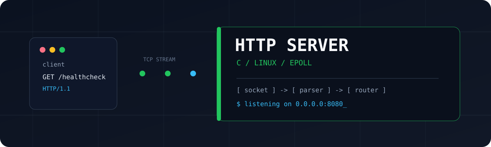

# HTTP Server in C



A small, work-in-progress HTTP server written in C for exploring networking,
concurrency, memory management, and POSIX system calls. The implementation is
intentionally close to the operating system and is not production-ready.

## Current Status

The executable currently implements the first part of an HTTP server:

- Creates an IPv4 TCP socket, enables address and port reuse, binds to
  `0.0.0.0:8080`, and listens with a backlog of 25.
- Uses `epoll` to wait for incoming connections and readable client sockets.
- Accepts clients and configures their sockets as non-blocking.
- Reads requests incrementally into an 8 KiB buffer.
- Parses an HTTP request line and up to 100 headers, including requests split
  across multiple reads.
- Looks up parsed request paths in the configured router, logs the request and
  headers, then closes the client connection.

The router is initialized with a `/healthcheck` route and supports route
registration, exact path lookup, and handler invocation. The listener has not
yet been wired to invoke registered handlers, so the executable does not send
responses. Response-building helpers and a fixed-size thread pool exist in the
source tree, but neither is used by the executable. The test suite covers
router lookup, request parsing, response construction and sending, server
setup, thread-pool task execution, and logging output.

## Running It

The server is Linux-specific because it uses `epoll`. It requires GCC or
another GNU C17 compiler, GNU Make, and POSIX threads.

```sh
make
./bin/server.out
```

In another terminal, send a request with `curl`:

```sh
curl -v http://127.0.0.1:8080/
```

The server logs the request to standard error and then closes the connection;
`curl` should not expect an HTTP response yet. Stop it with `Ctrl-C`.

The port is currently fixed at `8080` in `src/main.c`; there is no command-line
configuration.

## Build Targets

```sh
make          # build bin/server.out
make debug    # build debug/server.out with symbols and no optimization
make all      # build both normal and debug executables
make run      # build and run bin/server.out
make test     # build and run all unit test suites
make clean    # remove all generated files
make clean-bin
make clean-debug
```

The Makefile uses GNU C17, strict warnings treated as errors, automatic
dependency generation, and `pthread` support. Generated binaries, object
files, and dependency files are ignored by Git.

## Protocol Limits

The parser currently uses fixed-size structures defined in
`include/http/http.h`:

| Item | Limit |
| --- | ---: |
| Request buffer | 8192 bytes |
| Request method | 7 characters plus the terminator |
| Request target | 2047 characters plus the terminator |
| Protocol name | 15 characters plus the terminator |
| Header count | 100 |
| Header name | 63 characters plus the terminator |
| Header value | 1023 characters plus the terminator |

Request bodies, listener-to-router integration, request `Content-Length`
handling, keep-alive behavior, graceful shutdown, and complete malformed-
request handling are not implemented yet.

## Project Layout

| Path | Purpose |
| --- | --- |
| `src/main.c` | Starts the server on port 8080 |
| `src/server/server.c` | TCP socket setup, binding, and listening |
| `src/server/listener.c` | `epoll` loop, client acceptance, and request parsing |
| `src/http/parser.c` | Buffered request-line and header parsing |
| `src/http/response.c` | Response construction, JSON bodies, and sending helpers |
| `src/routes/router.c` | Route registration, exact path lookup, and handler invocation; listener integration is not implemented yet |
| `src/threadpool/threadpool.c` | Worker threads and bounded task queue |
| `src/log/log.c` | Logging and `errno` helpers |
| `include/` | Public interfaces and protocol data structures |
| `tests/` | Assertion-based unit tests for routing, parsing, responses, server setup, thread-pool tasks, and logging |
| `Makefile` | Build, run, test, debug, and cleanup targets |

## Areas Being Explored

- Treating TCP as a byte stream rather than assuming one `read` is one request
- Buffering incomplete input and finding HTTP CRLF line boundaries
- Converting untrusted bytes into bounded C structures
- Implementing a producer/consumer queue with `pthread` synchronization
- Managing ownership and lifetime across sockets, buffers, responses, and tasks
- Serializing structured data back into bytes for a socket

## Next Steps

Likely next steps are to invoke the router from the listener and generate
responses, connect client work to the thread pool, handle request bodies and
connection lifetime, and improve cleanup and shutdown paths.
